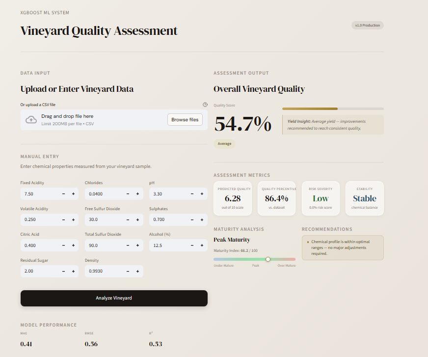

# Vineyard Quality Assessment Model


<div align="center">
  
  
  
  
</div>

<br>



<br>

Welcome to the **Vineyard Quality Assessment Model**, an end-to-end Machine Learning solution designed to revolutionize quality control in the viticulture industry. By analyzing 11 physicochemical properties of a wine batch, our extreme gradient boosting (XGBoost) engine instantly predicts quality scores, determines maturity indices, and provides actionable recommendations to vineyard owners.

---

## Key Features

- **State-of-the-Art ML Backend:** Powered by an optimized `XGBRegressor`, fine-tuned via `GridSearchCV` for maximum predictive accuracy on tabular chemical data.
- **Premium UI/UX:** A bespoke, glassmorphism-styled frontend built with Streamlit. Features custom CSS animations, DM Serif typography, and high-contrast metric cards.
- **Native Explainability:** Real-time Feature Importance charts (SHAP-inspired) so viticulturists know *exactly* which chemicals are driving their quality scores.
- **Actionable Insights:** The system translates raw metrics into plain English, offering recommendations like "Increase Alcohol" or "Reduce Volatile Acidity."
- **Batch Processing:** Instantly evaluate hundreds of vineyard yields by uploading a CSV file.

---

## Technology Stack

* **Frontend:** Streamlit, Custom CSS / HTML / Webkit
* **Machine Learning:** XGBoost, Scikit-Learn
* **Data Processing:** Pandas, NumPy
* **Serialization:** Joblib

---

## Installation & Usage

Follow these steps to run the application locally:

### 1. Clone the Repository
```bash
git clone https://github.com/yourusername/VineYard-Quality-Prediction-Model.git
cd VineYard-Quality-Prediction-Model
```

### 2. Install Dependencies
Ensure you have Python 3.9+ installed. Run the following command to install required packages:
```bash
pip install -r requirements.txt
```
*(Dependencies include: `streamlit`, `xgboost`, `scikit-learn`, `pandas`, `numpy`)*

### 3. Launch the Application
Start the Streamlit server:
```bash
streamlit run app.py
```
The application will automatically open in your default web browser at `http://localhost:8501`.

---

## Project Structure

```text
VineYard-Quality-Prediction-Model/
│
├── app.py                      # Main Streamlit Web Application & Custom CSS
├── main.py                     # CLI / Core Execution wrapper
├── premium_vineyard_sample.csv # Sample CSV for testing batch uploads
├── README.md                   # Project Documentation
│
├── src/
│   └── assessment_engine.py    # Core logic for risk analysis and maturity index
│
├── model/
│   ├── VineYardXGBoost.py      # End-to-End model training and tuning script
│   └── model_artifacts/        # Serialized XGBoost models and Scalers (.joblib)
│
└── Docs/                       # Project Reports, Master Guide, and Annexures
```

---

## Dataset

This project utilizes the benchmark **Wine Quality Dataset** from the UCI Machine Learning Repository. It contains 1,599 instances of red wine samples, mapping 11 input variables (e.g., Fixed Acidity, Chlorides, Total Sulfur Dioxide, pH) to a continuous Quality target (0-10 scale). 

To prevent data leakage and bias, the dataset is normalized using `StandardScaler` prior to XGBoost inference.

---

## Author

Developed as a Major/Mini Project in Artificial Intelligence & Machine Learning (AIML).

* **Sudhanshu Shukla** - *Roll No. 2301331530176*

**Supervised by:** Mr. Ritesh Rajput (Professor, Dept. of AIML, NIET)

---

<div align="center">
  <i>"Transforming agriculture through data-driven decisions."</i>
</div>
